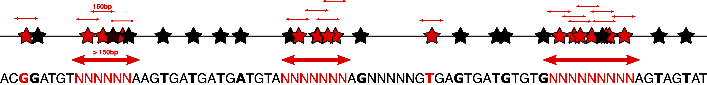

# angsd_pipeline for population genomics with low-coverage whole-genome sequencing

This pipeline was originally built by Claire Mérot with help and scripts from Eric Normandeau and many inputs from Anne-Laure Ferchaud and Amanda Xuereb.
It has been used for the analyses in the paper reference below, and it is flexible to be used for similar kind of analysis on different datasets.

Claire Mérot, Emma Berdan, Hugo Cayuela, Haig Djambazian, Anne-Laure Ferchaud, Martin Laporte, Eric Normandeau, Jiannis Ragoussis, Maren Wellenreuther, Louis Bernatchez, Locally adaptive inversions modulate genetic variation at different geographic scales in a seaweed fly, Molecular Biology and Evolution, 2021;, msab143
https://doi.org/10.1093/molbev/msab143

This version of the pipeline has been modified by Xavier Dallaire following exploration around mismapped reads creating SNPs in deviation from expectation of Hardy-Weinberg equilibrium and balanced allelic ratio (see preprint below).

Xavier Dallaire, Raphael Bouchard, Philippe Hénault, Gabriela Ulmo Diaz, Eric Normandeau, Claire Mérot, Louis Bernatchez, J.-S. Moore. (2023).  Widespread deviant patterns of heterozygosity due to autopolyploidization, repeated elements and duplication in whole-genome sequencing of salmonids. Genome Biology & Evolution: [https://doi.org/10.1093/gbe/evad229](https://academic.oup.com/gbe/article/15/12/evad229/7470724)

Here is a summary of the additions to the original pipeline:

- Implementation of ngsparalog (https://github.com/tplinderoth/ngsParalog) to identify and filter paralog and other duplicated SNPs (hereafter called deviant SNPs, as opposed to canonical SNPs)
- Diminution of runtime by parallelizing and removal of non-essential computation (e.g. SAF in analyses not related to site frequency spectrums)
- Various quality control assessment (coverage by sample, missingness)

IMPORTANT: run all commands from the angsd_pipeline folder

# overview of the pipeline 


# 00_DEPENDANCIES
install angsd & associated programs
http://www.popgen.dk/angsd/index.php/ANGSD

add angsd to the path in .bashrc

add the misc folder (containing RealSFS, theta stat etc to the path in .bashrc

export PATH="/home/camer78/Softwares/angsd2/angsd:$PATH"
export PATH="/home/camer78/Softwares/angsd2/angsd/misc:$PATH"

install NGSAdmix (maybe in the misc folder, else export its path)
http://www.popgen.dk/software/index.php/NgsAdmix

install pcangsd (maybe in the misc folder) & check if you have python2
http://www.popgen.dk/software/index.php/PCAngsd
copy the path into 01_config.sh `PCA_ANGSD_PATH=~/Softwares/pcangsd`

install ngsparalog
https://github.com/tplinderoth/ngsParalog
copy the path into 01_config.sh `NGSPARALOG_PATH=~/Softwares/ngsparalog`

install winsfs
https://github.com/malthesr/winsfs
copy the path into 01_config.sh `WINSFS_PATH=~/Softwares/winsfs`

install ngsLD
https://github.com/fgvieira/ngsLD

install mosdepth
https://github.com/brentp/mosdepth

for all script file, you may edit the header to put your email adress and adjust cpu/memory/time/allocation and slurm partition 

# 01_PREPARE_DATA

input: 
- bam-files
They must be aligned to the reference, indexed and sorted, named like "id_sex_pop_group_blablabla.sorted.bam.
They can  be kept in original folder, just know the path to their location from the angsd_pipeline folder

If all your bam files are in a single folder, insert the path in BAM_PATH= in the 01_config.sh

Useful for most analysis:

- info.txt in 02_info folder: a file listing the bamfile names ordered with a column for any relevant information on the individuals
for follow-up analyses with R ideally: col1=bam_filename, col2=id, col3=sex, col4=pop, col5=group, col6=group ...
- pop.txt in 02_info folder : a file listing population names with one item by line (there can be several files if we aimed at analysing different grouping, pop1.txt, pop_geo.txt, etc)

Necessary:

- genome.fasta in 02_info folder: the reference genome on which bam have been aligned

if it is not indexed run:
```
module load samtools

samtools faidx 02_info/genome.fasta
```
- region.txt: a file listing the regions of the genome (chromosome or scaffolds) to be included in the analysis.

For initial tests, put manually just a few, one per line

To list all scaffolds of the genome
You may want to reduce this list to improve computation time and exclude short unanchored scaffold. 
```
grep -e ">" 02_info/genome.fasta | awk 'sub(/^>/, "")' | sort -k1 > 02_info/region.txt
```

- region_num.txt: a list of two-digits numbers for ease of naming output files while parallelizing.
Example for a genome with 11 chromosome
```
01
02
03
04
05
06
07
08
09
10
11
```

- edit the 01_config.sh file

choose MIN_MAF, PERCENT_IND, MIN_DEPTH, MAX_DEPTH filter for intials steps
MAF is the minor allele frequency. you may want to adjust to your dataset and/or interest into rarer variants. Default value is 0.05
PERCENT_IND is the percentage if individuals for which we ask to have at least MIN_DEPTH reads to keep the position. It will remove position not well covered by sequences.
MIN_DEPTH is usualy set to 1 for low-coverage data but if your data is 4-5x, you may prefer to ask at least 2 reads for instance. One may also play with the percentage of individuals. 
MAX_DEPTH should be set at about 3-4 times the expected coverage if you want to exclude from your analyses the positions which may belong to duplicated or repeated regions.

For later steps, choose WINDOW and WINDOW_STEP for sliding-windows analyses, and K_MIN, K_MAX for admixture analysis

# 02_LIST_BAMFILES_AND_LIST_BY_POP
This script will make a list of all bamfiles and several list by population, based on information in bamfile names and pop.txt
WARNING: you may have blanks or duplicates -> if you want to check them you can keep them but for all regular analysis it will be important to remove them from the bamlist.
Blanks will be useless as there are nothing and have almost no reads. Duplicates will messed up with the PCA as they will have a very high covariance.

edit script if you want to add another way of grouping (group.txt)

If all your bam files are in a single folder, run:
```
./01_scripts/02_list_bamfiles_singlefolder.sh
```
WARNING: if you re-run this script after editing your bam.filelist (e.g. to remove duplicates or outliers), it will replace it...

If your bam files are in multiple folders, manually create a file `02_info/bam.filelist` containing the list of wanted bam files, then run:
```
./01_scripts/02_list_bamfiles_multifolder.sh
```

At this point, you might already want to check for outlier samples to exclude from your analyses. Mosdepth can be used to quickly estimate the average coverage on the first chromosome of each bamfile. Samples with too low coverage could be removed, and samples with too high coverage could be subsampled (for example with `samtools view -s`)
```
sbatch 01_scripts/utility_scripts/mosdepth_by_bam.sh
```
NB: This script uses grep to recognize patterns corresponding to your samples ID in the bam file names (e.g. `[A-Z][A-Z][A-Z]s_[0-9][0-9][0-9]-[0-9][0-9]`). Edit it to fit your data.

# 03 Run initial SNP calling on whole dataset, with filtration
## A) Call SNP and run ngsparalog to filter deviant SNPs

This script will work on all bamfiles and use ANGSD to call SNPs that pass coverage and MAF filters, then calculate the likelihoods that reads wer mismapped at the position of snps using ngsparalog to produce list of canonical and deviant SNPs. At this step, it is not necessary to output genotype likelihoods in a beagle file.

This process was parallelized by chromosomes for considerable gains in efficiency.
For example, to run all your chromosomes in SLURM (10 chromosomes at a time), use:
```
cat 02_info/regions_number.txt | parallel -j10 srun -c 4 --mem 20G -p ibis_small -o log_%j --time 1-00:00 ./01_scripts/03A_ngsparalog.sh {}
```
Adjust -j and -c to fit your available ressources, and -p to your partition name.

## B) Run ANGSD on the retained SNPs

Now that we have lists of canonical SNPs for each chromosome, we can run ANGSD again to calculate genotype likelihoods at those positions.

```
cat 02_info/regions_number.txt | parallel -j10 srun -c 4 --mem 20G -p ibis_small -o log_%j --time 1-00:00 ./01_scripts/03B_gl_maf_canonical.sh {}
```

After running each chromosome in parallel, use the following script to combine all chromosomes in a single beagle file for the next steps.
```
source 01_scripts/01_config.sh
./01_scripts/utility_scripts/concat_chr_beagle.sh 03B_gl_maf_canonical/all_maf"$MIN_MAF"_pctind"$PERCENT_IND"_maxdepth"$MAX_DEPTH_FACTOR" beagle
```


## C) Prune dataset for linkage desiquilibrium (optional)

LD pruning is performed in three steps :  

1) Computing the correlation between nearby SNPs (here < 500kb, but can be modified in the script).
```
cat 02_info/regions_number.txt | parallel -j 10 srun -p ibis_medium -c 5 --mem=20G --time=7-00:00 -o log_%j 01_scripts/03C1_ngsLD.sh {}
```

2) Plotting the LD decay across distance
```
sbatch 01_scripts/03C2_LDdecay.sh
```
Inspect the resulting file to set distance and weight threshold for step 3.


3) Pruning the linked SNPs through a graph method.
```
cat ./02_info/regions_number.txt | parallel -j20 srun -p ibis_medium -c 1 --mem=20G --time=7-00:00 -o log_%j 01_scripts/03C3_LDpruning.sh {} 200000 0.1
```
Here we pruned until no pairs of SNP inside 200kb were correlated over 0.1. This should drastically reduce the number of SNPs to satistify the assumption of indendance of SNP for population structure assessment (04 and 05), as well as speed up the process. This script will produce a list of remaining SNPs (.pruned) and will create a pruned beagle by chr file by extracting for the output of 03B.

After running each chromosome in parallel, use the following script to combine all chromosomes in a single beagle file for the next steps.
```
source 01_scripts/01_config.sh
./01_scripts/utility_scripts/concat_chr_beagle.sh 03B_gl_maf_canonical/all_maf"$MIN_MAF"_pctind"$PERCENT_IND"_maxdepth"$MAX_DEPTH_FACTOR" beagle.pruned
```


# 04 PCA to visualise population structure and exclude potential outliers 
this script will work on all individuals using the beagle genotype likelihood and calculate a covariance matrix with angsd.
it also output the pca with R, and visualisation in pdf

The PCA tend to be driven by few outliers (unclear why) and by duplicates (typically 2 points at an extreme of a PC). They will also be affected by related or inbred samples that co-vary too much with each other. Check for all that, and remove the ones you want. (For duplicate we often keep the one with the more coverage) by editing the bam.filelist. Finally re-run step 03B and 04 with an edited bamlist.

this requires pcangsd to be cloned and a version of Python v2 with alias "python2"

maybe edit NB_CPU and memory (sometimes require a lot of memory >100 G)
```
conda activate pcangsd_test
sbatch 01_scripts/04B_pca.sh
```
for further visualisation using information from info.txt, the script 01_scripts/Rscripts/visualise_pca.r can be useful.
The current visualisation is very basic and was tuned for my 3-groups inversion so it uses Kernel statistics to colour into three groups. Don't bother too much about it, just look at the general repartition of points and export the .pca file to your computer to tune the colours to your own needs (population, sex, etc)

If you performed LD pruning at step 03, this script can easily produce a PCA for the pruned data:
```
conda activate pcangsd_test
sbatch 01_scripts/04C_pca_LDpruned.sh
```

# 05 ADMIXTURE analysis (NGSAdmix)
this script will work on all individuals using the beagle genotype likelihood and perform an admixture analysis. 
this requires NGSadmix to be installed and its path export in the bashrc. 
NGS admiw will explore all number of population between K_MIN and K_MAX as provided in the 01_config.sh.

maybe edit NB_CPU=1 & edit K_MIN and K_MAX in the 01_config.sh

To run NGSAdmix on your complete (filtered) dataset:
```
sbatch 01_scripts/05B_ngs_admix.sh
```

However, this clustering appproach assumes independance of genetic markers. As such, consider performing LD pruning (`03C`), then running `05C` instead. With a shortened list of SNPs, this step will run much faster, especially at higher values of K.
```
sbatch 01_scripts/05C_ngs_admix_LDpruned.sh
```

for further visualisation using information from info.txt, the script 01_scripts/Rscripts/visualise_admix.r can be useful

# 06 Calculate allelic frequencies by population
This script will work on bamfiles by population and calculate maf.
It will run on the list of canonical sites determined at step 3A (filter on global population). Major and minor alleles are polarized by the list of SNPs from step 03A which means that an allele can be minor at the scale of all populations but at frequency >50% in a given population.

Keeping this polarisation is important because we want to have the frequency of the same allele accross populations. Note that you can also choose to polarize your alleles from the start using the reference genome (`-doMajorMinor 4 -ref 02_info/genome.fasta`), or an ancestral genome if you have one (`-doMajorMinor 5 -anc 02_info/ancestral_genome.fasta`). Don't forget to index your genome.

In addition it will filter for sites with at least one read in a minimum proportion of individuals within each pop

maybe edit cpu & choose on which list of pop run the analyses
NB_CPU=1 & POP_FILE1=02_info/pop.txt 
```
sbatch 01_scripts/06_maf_by_pop.sh
```
The resulting MAF by population are the data used by the selection_analysis pipeline which does environmental associations.

# 07 Calculate pairwise FST
This script will calculate the unfold saf by population; then the 2dSFS and FST for each pair of populations

It starts with a R script that subset the population bamlist ot have the same number of individuals as this factor can strongly influence Fst values.

FST calculation is run after filtering for deviant SNPs (`03A`), as these can lead to underestimation of population structure.

maybe edit
```
NB_CPU=1 #change accordingly in SLURM header

POP_FILE1=02_info/pop.txt #choose on which list of pop run the analyses

sbatch 01_scripts/07_fst_by_group.sh
```
for further visualisation (requires the corrplot package), you may use 01_scripts/Rscripts/visualise_fst.r 

# 08 Calculate thetas
For the estimation of theta statistic, we can not filter for MAF, as we want to keep all positions, including invariant ones (without SNP, MAF = 0). For the same reason, we can not provide the list of SNPs filtered by ngsparalog. To avoid the overestimation of genetic diversity by including spurious deviant SNPs, we will first create a copy of our reference (or ancestral) genome in which the regions around deviant SNP is masked. You will need the `data.table`and `GenomicRanges` R packages (through [Biocmanager](https://bioconductor.org/packages/release/bioc/html/GenomicRanges.html)).



The 08 script then calculates the saf, 1DSFS and thetas statistics by population.

Beware if ancestral sequence is the reference (folded spectrum), not all stats are meaningful.
```
sbatch 01_scripts/mask_deviants.sh
sbatch 01_scripts/08_thetas_by_pop.sh
```
# 09_MAKE_GWAS
those two scripts can do a gwas either with binary phenoty "_bin" or quantitative phenotype "_quant".

phenotype files should be put in 02_info (see some examples herein)
- bin_pheno.txt #this file must be one single column with phenotype coded as 1 or 2, each line is one individual in the same order as bamfile
- quant_pheno.txt #this file must be one single column with quantitative phenotype, each line is one individual in the same order as bamfiles. 
Beware, the quantitative gwas is made to include a covariable (for instance sex) coded as binary # change the $COV if needed
Missing data must be coded -999

In the quant script, There are three ways of implementing the GWAS. See Angsd help about it http://www.popgen.dk/angsd/index.php/Association
```
sbatch 01_scripts/09_gwas_bin.sh

sbatch 01_scripts/09_gwas_quant.sh
```
# 10 MAKING PCA BY WINDOW ALONG GENOME
This step include several modules that should be run successively
important: edit window size - this is a number of SNPs
windows od 100 to 10 000 SNPs allows analysis along the genome, while a large window can be chosen if one wants to make a pca by chromosome (see also 10C to directly do a local PCA on a given window)

A- This script will call a python script written by Eric Normandeau to split the begale files into windows of a given size within 
each chromosome/scaffold. They are stored into beagle_by_window folder
Then, it will run pcangsd on each window of X SNPs. Covariances matrices are stored into cov_by_window folder
```
sbatch 01_scripts/10A_cov_by_window.sh
```

B- This script will call a R script using the lostruct package https://github.com/petrelharp/local_pca
It applies the method proposed in Li, H., & Ralph, P. (2019). Local PCA shows how the effect of population structure differs 
along the genome. Genetics, 211(1), 289-304.

In addition, the R script test correlation between the PC1 scores of each window and the PCs of the global pca done at step 04

IMPORTANT: edit window size to fit what was given to the A script, edit the nb of individuals and the nombre of PC to consider in lostruct, and the nb of axis of the MDS to look at and save

```
window_size=100 #nb of Snps per window
N_IND=1446 #nb of individuals included in the analysis
N_PC=2 #nb of PC to consider when comparing windows
N_MDS=50 #nb of MDS dimension in the output
```

```
sbatch 01_scripts/10B_pca_lostruct.sh
```

C and D- After the analysis of the MDS which may highlight regions of interest, or if one is interested in doing PCA on a chosen window

The script 10C will run automatically on all the MDS axis chosen to output the cluster of windows which are outliers on each MDS, and the associated PCA. 
One will need to adjust key parameters to one's dataset. See L31:
#parameters to group together into a cluster the outliers windows
max_MDS=11 #nb of mds on whcih to work
sd_lim=4 #limit for being outlier
x_between=20 #merge window with this number of windows between them
min_n_window=5 #remove cluster with less than this number of window

It will output pca,eigen-values and images for each cluster of windows (by MDS) and a list of MDS/windows outliers.

The script 10D is more of a manual/custom one that will call select the region in the beagle using a python script written by Eric Normandeau, call Pcangsd to get the covariance matrix, and a R script to get the PCa and plot it.

important: this requires a file with two column with the start and stop of the wanted region separated by a tab
for instance
```
LG1_125 LG1_456
```

It will output pca, eigen-values and images.


# 11 LD pruning with PLINK
This step allow outputing genotype likelihoods in plink format and run plink to extract a list of LD-pruned SNPs.

by default values for Plink pruning are as follow and can be adjusted directly in the script 
```
WINDOW=100
SNP=5
VIF=2

sbatch 01_scripts/11_plink_pruning.sh
```
# 12 LD calculation by NGSLD
There are two sets of scripts: the ones "byLG" which will loop on chromosomes to do them separately, and the ones "fusion" that will do two chromosomes, including LD within adn between chromosomes.

Step A is making a begale file with more stringent filtering

To reduce computation time and focus on informative positions, this script re-run the 1st step of ANGSD to output a beagle with a differnt threhold of MAF and percent of individuals with at least 1 read, and by chromosome (LG).

This may be edited in the script with the following variables. region_LG.txt is a text file with one chromosome name per line. It loops over it, but it can also be parrallelized by chromosome.


```
LG_FILE1= 02_info/region_LG.txt #work on a chosen subset of LG
MIN_MAF=0.10 #filter : will keep SNP above this allele frequency (over all individuals)
PERCENT_IND=0.75 #filter : will keep SNP with at least one read for this percentage of individuals
MAX_DEPTH_FACTOR=3 #filter : will keep SNP with less than X time the nb of individuals total coverage
```
WARNING: check very well the number of sites in the beagle output (either counting the number of lines in the beagle or the SITEs file. If this is too big >50,000 SNPs it will create very very big matrices which may crash the server (terabytes size!!). you may want to either re-run step A with more stringent filters or adjust the parameter in ngsLD that will use a random subset of your snps

Step B (& C)  uses NGSld https://github.com/fgvieira/ngsLD to calculate linkage disequilibrium.

LD calculation is followed by a python script writted by Eric Normandeau (ld_by_blocks_XX.py) which summarize the LD by blocks of a given size, and output the different quantile of the R² distribution. It will need the header.txt file to be in the folder 12_ngsLD.

Eric made a faster script (also in the utility folder) called "optimized", which runs faster but only output the R²em and first quantile (this is usually enough for most visualisation)

2021: There is an even faster file that uses the compressed version of the ld, saving lots of space and does not need any header.
```
python3 01_scripts/utility_scripts/ld_by_blocks_optimized.py "$LD_FILE" 500 "$LD_FILE"_by_500.ld
```

Below are a few lines of codes that would help representing it into a heatmap in R

```
FILE=""
mat_ld_all_chr1<-read.table(FILE, header=T)
mat_ld_all_chr1<-mat_ld_all_chr1[-which(mat_ld_all_chr1$Pos1==mat_ld_all_chr1$Pos2),]
head(mat_ld_all_chr1)

variable_name=0.02

mat_ld_all_chr1_var<-mat_ld_all_chr1[mat_ld_all_chr1$Percent==variable_name,]
head(mat_ld_all_chr1_var)

ggplot(mat_ld_all_chr1_var,aes(x=Pos1/1000,y=Pos2/1000)) + theme_classic() +
  geom_tile(aes(fill=R2))+
  scale_fill_gradientn(colours=c("white","lightgrey","grey80","turquoise","deepskyblue3","blue3","navyblue","black"), limits=c(0,1), values=c(0,0.125,0.25,0.375,0.5,0.675,0.75,1), name="R2")+ xlab("position (Mb)") + ylab("position(Mb)") +
  scale_x_continuous(expand=c(0.02,0))+
  scale_y_continuous(expand=c(0.02,0)) +
  coord_fixed(ratio = 1)

```

Step D - Those scripts more specific, they are used to calculate LD on sub-groups of individuals (for instance homokaryotes of an inversion). 

To make Ld comparable between groups, it will subset each group to have the same number of samples, using a R script
Then, it loops over each group to make sub-beagle for each group, calculate LD and output it by blocks

Again we edit some variables, and choose which LG to run on and which group of samples
```
LG=LG3 #work on a one chromosme
GROUP=karyotype_LG3
POP_FILE1=02_info/"$GROUP".txt #choose on which list of pop run the analyses

#do not edit if 12A has been run for each LG under the same filters. if not, please run before
#because we are here re-using the beagle produced with all samples, on the given LG
MIN_MAF=0.10 #filter : will keep SNP above this allele frequency (over all individuals)
PERCENT_IND=0.75 #filter : will keep SNP with at least one read for this percentage of individuals
MAX_DEPTH_FACTOR=3 #filter : will keep SNP with less than X time the nb of individuals total coverage
```


# 13 Hardy-Weinberg statistics and Hobs
This step use the -hwe module of angsd to output HW statistics per population/group.

I have add a Rscript it to extract the number of heterozygotes observed at each SNP.

We later uses the windowscannr library in R to calculate Hobs along the genome for each group
https://github.com/tavareshugo/WindowScanR

```
sbatch 01_scripts/13_hwe.sh
```
# ANALYSING_MAF_SELECTION_TESTS_ETC
See selection_pipeline

